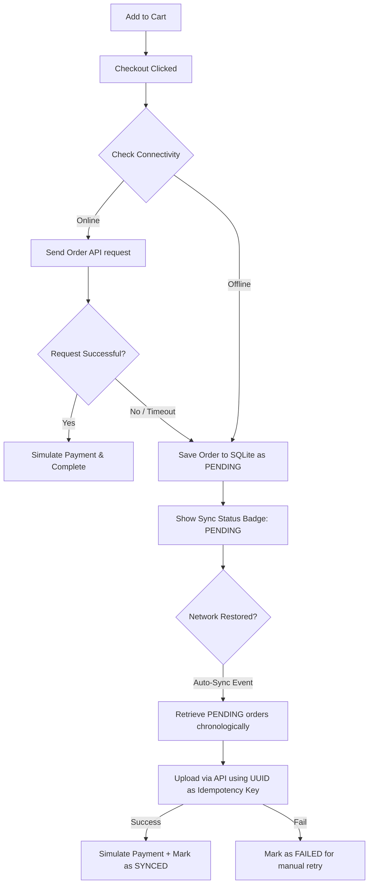

# Mini Merchant POS (Offline-First + RBAC)

A cross-platform Flutter application implementing a robust, offline-first Point of Sale (POS) system integrated with Role-Based Access Control (RBAC). 

This project is built using a strict **Feature-Wise Clean Architecture** pattern and managed via **plain Riverpod** (no code generation) for State Management and Dependency Injection.

---

## 🚀 Key Architectural Pillars

### 1. Feature-Wise Clean Architecture
The codebase is structured by feature rather than layer, making it modular, scalable, and easy to maintain. Each feature contains three main layers:
*   **Domain Layer**: Pure business logic containing Entities, Usecases, and Repository Interfaces (completely independent of external frameworks).
*   **Data Layer**: Responsible for data fetching, caching, and mapping. Contains Models, Repository Implementations, and Data Sources (Remote via Dio, Local via SQLite/SharedPreferences).
*   **Presentation Layer**: Contains the UI widgets/screens and Riverpod state management providers (`StateNotifier` / `FutureProvider` / `StreamProvider`).

### 2. State Management & Dependency Injection (Riverpod)
*   Implemented using **plain Riverpod** (explicit providers) to avoid complex build-runner/code-generation workflows.
*   Separate providers handle service registration, database helpers, HTTP clients, and business logic.
*   Enforces unidirectional data flow and reactive UI updates.

### 3. Offline-First Sync Architecture
*   **Local Caching**: Uses **SQLite** (`sqflite`) to persist orders locally when offline.
*   **Idempotency Guarantee**: Every local order is generated with a unique RFC 4122 version 4 UUID (`localOrderId`), serving as an idempotency key.
*   **Connectivity Monitoring**: Integrates `connectivity_plus` to listen for network status changes.
*   **Auto-Sync Engine**: An automatic background sync listener kicks off whenever a transition from offline to online is detected, attempting to upload all pending local orders to the backend in the correct chronological sequence.
*   **Manual Recovery**: Includes manual retry triggers for any orders flagged with a `FAILED` synchronization status.

---

## 📁 Project Directory Structure

```text
lib/
├── core/                              # Core shared files across features
│   ├── constants/                     # API routes, app-wide configuration
│   ├── database/                      # SQLite DB Helper and schema migrations
│   ├── error/                         # App failures and exceptions
│   ├── network/                       # Dio network client and connectivity tracker
│   ├── router/                        # GoRouter configuration & route paths
│   └── usecase/                       # Base Usecase interface definitions
│
├── features/                          # Feature-Wise Modules
│   ├── auth/                          # Authentication (Login, JWT, RBAC check)
│   ├── cart/                          # Cart management (in-memory state)
│   ├── orders/                        # Order management (Create, Offline DB, Sync logic)
│   ├── products/                      # Product management (Listing, Search)
│   └── reports/                       # Dashboard Analytics (Admin reports)
│
└── main.dart                          # Application entry point & initializations
```

Each feature submodule (e.g., `features/orders/`) is organized as:
```text
features/feature_name/
├── data/
│   ├── datasources/                   # remote_datasource.dart, local_datasource.dart
│   └── repositories/                  # repository_impl.dart
├── domain/
│   ├── entities/                      # Business entity classes
│   ├── repositories/                  # Abstract repository contracts
│   └── usecases/                      # Individual usecase logic classes
└── presentation/
    ├── providers/                     # StateNotifier & plain Riverpod providers
    └── screens/                       # Presentation screens and components
```

---

## 🛠️ Technology Stack

*   **Framework**: [Flutter SDK](https://flutter.dev) (v3.x)
*   **State Management & DI**: [Riverpod](https://pub.dev/packages/flutter_riverpod)
*   **Local Database**: [SQLite (sqflite)](https://pub.dev/packages/sqflite)
*   **Network Client**: [Dio](https://pub.dev/packages/dio) with custom interceptors for JWT injection and request timeout handling
*   **Routing**: [GoRouter](https://pub.dev/packages/go_router)
*   **UUID Generation**: [uuid](https://pub.dev/packages/uuid)
*   **Connection Monitoring**: [connectivity_plus](https://pub.dev/packages/connectivity_plus)

---

## ⚙️ Role-Based Access Control (RBAC) Matrix

The app defines three functional user roles. UI elements (buttons, pages, and menus) are dynamically enabled or hidden based on the logged-in user's privileges:

| Feature / Permission | Admin | Merchant | Employee |
| :--- | :---: | :---: | :---: |
| **View Products** | ✅ | ✅ | ✅ |
| **Manage Cart** | ✅ | ✅ | ✅ |
| **Create Local Order** | ✅ | ✅ | ✅ |
| **Collect Payments** | ✅ | ✅ | ❌ |
| **Trigger Force Sync** | ✅ | ✅ | ❌ |
| **View Analytics Reports** | ✅ | ❌ | ❌ |

---

## 🔄 Offline Sync Workflow



---

## 🔑 Demo Credentials

To test the role-based views, authenticate using the following backend-validated accounts:

*   **Admin Role**: 
    *   *Username*: `admin`
    *   *Password*: `admin123`
*   **Merchant Role**: 
    *   *Username*: `merchant`
    *   *Password*: `merchant123`
*   **Employee Role**: 
    *   *Username*: `employee`
    *   *Password*: `employee123`

**API Base URL**: `https://pos-test.equilym.com/api`  
**Swagger UI**: `https://pos-test.equilym.com/docs`

---

## 🏃 Getting Started & Setup Instructions

### Prerequisites
*   [Flutter SDK](https://flutter.dev/docs/get-started/install) installed (matching your editor configuration).
*   An active internet connection (for initial package download and remote API requests).
*   iOS Simulator, Android Emulator, or a Physical Device.

### Steps to Run

1.  **Clone the repository**:
    ```bash
    git clone <repository_url>
    cd mini_merchant_pos_flutter
    ```

2.  **Install project dependencies**:
    ```bash
    flutter pub get
    ```

3.  **Analyze the code**:
    Check for any linting errors or compilation warnings:
    ```bash
    flutter analyze
    ```

4.  **Run the application**:
    To run on your default connected device:
    ```bash
    flutter run
    ```
